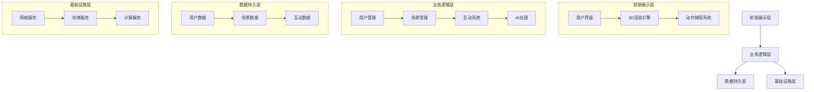

# 2. System Architecture

## Architecture Overview

iAvatar采用分层架构设计，通过模块化和微服务架构确保系统的可扩展性和维护性。系统架构包含前端展示层、业务逻辑层、数据持久层和基础设施层。

### 系统架构图

## Core Modules

### 1. 前端展示层
- **用户界面模块**
  - 响应式界面设计
  - 用户交互控制
  - 状态管理和反馈

- **3D渲染引擎**
  - 场景渲染
  - 模型加载和管理
  - 特效系统

- **动作捕捉系统**
  - 实时姿态识别
  - 表情捕捉
  - 动作同步

### 2. 业务逻辑层
- **用户管理模块**
  - 账号管理
  - 权限控制
  - 个人信息管理

- **场景管理模块**
  - 场景创建和编辑
  - 资源管理
  - 场景状态同步

- **互动系统模块**
  - 实时通信
  - 多人同步
  - 行为处理

- **AI处理模块**
  - 自然语言处理
  - 智能助手
  - 行为分析

## Data Flow

### 1. 用户数据流
1. 用户登录/注册
2. 个人信息同步
3. 权限验证
4. 状态更新

### 2. 场景数据流
1. 场景加载请求
2. 资源预加载
3. 场景状态同步
4. 实时更新

### 3. 互动数据流
1. 用户行为采集
2. 实时数据处理
3. 状态广播
4. 数据持久化

## Integration Points

### 1. 外部系统集成
- **认证系统**
  - OAuth2.0集成
  - 单点登录支持

- **存储系统**
  - 云存储接口
  - CDN服务

- **AI服务**
  - 自然语言处理API
  - 计算机视觉服务

### 2. 第三方服务集成
- **即时通讯**
  - WebSocket服务
  - 信令服务器

- **媒体处理**
  - 音视频编解码
  - 流媒体服务

### 3. 监控和运维
- **性能监控**
  - 系统指标采集
  - 性能分析

- **日志管理**
  - 日志收集
  - 错误追踪

- **报警系统**
  - 异常检测
  - 通知推送