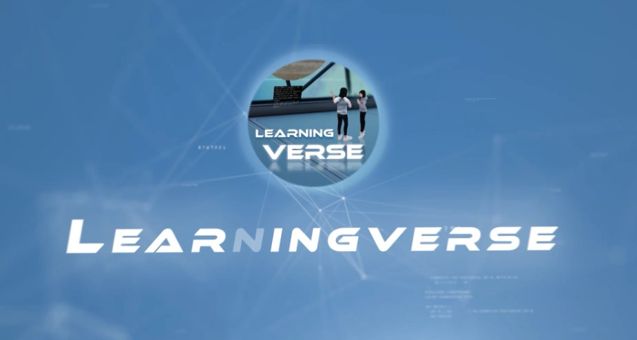

---
layout:
  title:
    visible: true
  description:
    visible: true
  tableOfContents:
    visible: true
  outline:
    visible: true
  pagination:
    visible: true
---

# 🖥️ LearningVerse

<figure><figcaption></figcaption></figure>

## Welcome to LearningVerse Documentation

LearningVerse is a comprehensive virtual avatar platform built on Unity that enables users to create personalized 3D avatars with real-time motion capture, network multiplayer interaction, AI conversation capabilities, and advanced 3D pose tracking.

This documentation provides detailed information about the LearningVerse platform, including:
- Feature overview and capabilities
- Technical implementation details
- Installation and configuration guides
- API references and code examples
- Troubleshooting and FAQ

## Video Demonstrations

Check out these videos showcasing LearningVerse's features:













## Download

Download LearningVerse from:
[https://drive.google.com/drive/folders/1jA99yZZk\_c94-wtABnM4UTvNkHtuEzHu](https://drive.google.com/drive/folders/1jA99yZZk_c94-wtABnM4UTvNkHtuEzHu)

<table data-view="cards" data-full-width="false"><thead><tr><th></th><th data-type="content-ref"></th><th data-hidden data-card-target data-type="content-ref"></th><th data-hidden data-type="files"></th><th data-hidden data-card-cover data-type="files"></th></tr></thead><tbody><tr><td>Download Link</td><td></td><td><a href="https://drive.google.com/drive/folders/1jA99yZZk_c94-wtABnM4UTvNkHtuEzHu?usp=sharing">https://drive.google.com/drive/folders/1jA99yZZk_c94-wtABnM4UTvNkHtuEzHu?usp=sharing</a></td><td><a href=".gitbook/assets/Learningverse_Logo 1.png">Learningverse_Logo 1.png</a></td><td><a href=".gitbook/assets/download-cloud.png">download-cloud.png</a></td></tr><tr><td></td><td></td><td></td><td></td><td></td></tr></tbody></table>

# Table of contents

* [🖥️ LearningVerse](README.md)
* [1. Project Overview](1-project-overview.md)
* [2. System Architecture](2-system-architecture.md)
* [3. Features](3-features/README.md)
  * [3.1 Virtual Avatar System](3-features/3.1-avatar-system.md)
  * [3.2 Motion Capture System](3-features/3.2-motion-capture.md)
  * [3.3 Network Multiplayer](3-features/3.3-network-multiplayer.md)
  * [3.4 AI Conversation System](3-features/3.4-ai-conversation.md)
  * [3.5 Scene & UI Management](3-features/3.5-scene-ui-management.md)
* [4. Technical Implementation](4-technical-implementation.md)
* [5. Editor Tools & Extensions](5-editor-tools.md)
* [6. Installation & Configuration](6-installation.md)
* [7. User Guide](7-user-guide.md)
* [8. API Reference](8-api-reference.md)
* [9. FAQ](9-faq.md)
* [10. Changelog](10-changelog.md)
* [11. Contact & Support](11-support.md)

# 1. Project Overview

## Introduction

LearningVerse is a comprehensive virtual avatar platform developed with Unity that enables users to create and interact with customized 3D avatars. The platform integrates real-time motion capture, network multiplayer capabilities, AI-powered conversations, and advanced 3D pose tracking to deliver an immersive virtual experience.

<figure><figcaption>LearningVerse Platform Interface</figcaption></figure>

## Key Features

### Virtual Avatar System
Create and customize 3D avatars with extensive personalization options:
- Predefined avatar selection
- ReadyPlayerMe avatar import
- Custom avatar uploading and editing

### Motion Capture
Implement real-time pose estimation and tracking:
- Camera-based body tracking
- Facial expression detection
- Hand gesture recognition

### Network Multiplayer
Enable multiple users to interact in shared virtual spaces:
- Avatar position and movement synchronization
- Scene object state synchronization
- Room creation and management

### AI Conversation
Facilitate natural language interactions with AI:
- Text-based dialogue system
- Character configuration and memory
- Text-to-speech conversion

### Scene & UI Management
Provide intuitive user interfaces and scene transitions:
- Scene loading and transitions
- Responsive UI components
- User data management

## Use Cases

The LearningVerse platform is designed for various applications:

1. **Virtual Education**: Create interactive learning environments with AI tutors
2. **Remote Collaboration**: Enable geographically distributed teams to work together in virtual spaces
3. **Digital Performances**: Support virtual performances and presentations
4. **Social Interaction**: Facilitate social gatherings in customized virtual spaces
5. **Content Creation**: Generate content for videos, games, and other media

## System Requirements

- **Operating System**: Windows 10/11, macOS 10.15+
- **Processor**: Intel i5 or equivalent (i7 recommended)
- **Memory**: 8GB RAM (16GB recommended)
- **Graphics**: DirectX 11 compatible graphics card
- **Camera**: Webcam or compatible camera device
- **Internet Connection**: Broadband connection for multiplayer features

# 2. System Architecture

## Architecture Overview

The LearningVerse system is built on a modular architecture that enables flexibility, scalability, and maintainability. The platform is composed of five core modules that work together to deliver a comprehensive virtual avatar experience.

<figure><figcaption>LearningVerse System Architecture</figcaption></figure>

## Core Modules

### 1. Avatar Management Module

This module handles all aspects of avatar creation, customization, and data management:

- Avatar selection and loading
- Customization and editing tools
- Avatar data storage and synchronization

**Key Components:**
- AvatarUI
- ModelSelect
- RuntimeLoadAvatar
- ES3AvatarData

### 2. Motion Capture Module

Responsible for processing camera input, estimating poses, and mapping movements to avatars:

- Camera input processing
- Pose estimation algorithms
- Avatar animation mapping

**Key Components:**
- VNectBarracudaRunner
- WebCamInput
- PoseVisualizer
- LearningVersePose3D

### 3. Network Communication Module

Enables multi-user interactions within shared virtual environments:

- Network connection management
- Data synchronization
- Room and session handling

**Key Components:**
- AvatarConnectionManagement
- AvatarDataSyncScript
- NetworkSyncScript
- CharacterMovementNET

### 4. AI Conversation Module

Provides natural language processing and AI-powered interactions:

- Dialogue processing
- Character configuration
- Text-to-speech conversion

**Key Components:**
- ChatWithAIAgentExample
- StreamDataReceiver
- TTSSender
- StreamingAudioPlayer

### 5. Scene & UI Management Module

Handles scene transitions, UI interactions, and user data management:

- Scene loading and transitions
- UI components and interactions
- User preferences and settings

**Key Components:**
- select_scene
- BasicGridAdapter
- ButtonController
- DefaultSceneLoader

## Data Flow

The LearningVerse system processes data through the following flow:

1. **Input Collection**: Camera feeds, user inputs, and network data are collected
2. **Processing**: Data is processed by the appropriate modules (e.g., pose estimation, dialogue processing)
3. **State Management**: The system maintains and updates the state of avatars, environments, and interactions
4. **Rendering**: Visual output is generated based on the current state
5. **Synchronization**: Data is synchronized with other users through the network module

## Integration Points

The system provides several integration points for extending functionality:

```csharp
// Example: Avatar System Integration
public interface LearningverseProvider
{
    GameObject LoadAvatar(string avatarUrl);
    void UpdateAvatar(GameObject avatar, Dictionary<string, object> properties);
    void SaveAvatarData(GameObject avatar, string userId);
}

// Example: AI Conversation System Integration
public interface IAIConversationService
{
    void SendMessage(string message, Action<string> onResponse);
    void ConfigureCharacter(string characterProfile);
    void ProcessVoiceInput(AudioClip audioInput, Action<string> onTranscription);
}
```

## Deployment Architecture

The LearningVerse platform can be deployed in various configurations:

- **Standalone Application**: All components run locally on the user's device
- **Client-Server**: Core processing happens on the server, with clients handling rendering and input
- **Hybrid**: Distribution of processing based on available resources and requirements

<figure><figcaption>Deployment Architecture Options</figcaption></figure>

# 3. Features

## Feature Overview

The LearningVerse platform offers a comprehensive set of features designed to create immersive virtual avatar experiences. This section details each major feature set and provides implementation examples.

<figure><figcaption>Feature Overview</figcaption></figure>

## Major Feature Categories

### [Virtual Avatar System](3.1-avatar-system.md)
Create, customize, and manage virtual avatars with extensive personalization options.

### [Motion Capture System](3.2-motion-capture.md)
Implement real-time pose estimation and tracking for natural avatar movements.

### [Network Multiplayer](3.3-network-multiplayer.md)
Enable multiple users to interact in shared virtual spaces with synchronized avatar movements.

### [AI Conversation System](3.4-ai-conversation.md)
Facilitate natural language interactions with AI characters and text-to-speech capabilities.

### [Scene & UI Management](3.5-scene-ui-management.md)
Provide intuitive user interfaces, scene transitions, and data management tools.

## Integration Examples

The following code example demonstrates how the different feature sets can be integrated:

```csharp
// Sample integration of major features
public class LearningVerseManager : MonoBehaviour
{
    // Avatar System
    [SerializeField] private AvatarUI avatarUI;
    [SerializeField] private RuntimeLoadAvatar runtimeLoader;
    
    // Motion Capture
    [SerializeField] private VNectBarracudaRunner poseEstimator;
    [SerializeField] private WebCamInput webCamInput;
    
    // Network
    [SerializeField] private AvatarConnectionManagement connectionManager;
    [SerializeField] private AvatarDataSyncScript dataSyncScript;
    
    // AI Conversation
    [SerializeField] private ChatWithAIAgentExample chatSystem;
    [SerializeField] private TTSSender ttsSender;
    
    // Scene & UI
    [SerializeField] private select_scene sceneManager;
    
    public void InitializeAllSystems()
    {
        // Initialize avatar
        string avatarUrl = ES3FormUser.Load<string>("AvatarUrl");
        runtimeLoader.LoadAvatar(avatarUrl);
        
        // Setup motion capture
        webCamInput.StartCamera();
        poseEstimator.InitializeModel();
        
        // Connect to network
        connectionManager.InitializeConnection();
        
        // Setup AI conversation
        chatSystem.InitializeChatHistory();
        
        // Configure scene
        sceneManager.PrepareScenes();
    }
}
```

Each feature section provides detailed information about implementation, customization options, and usage examples.

# 3.3 Network Multiplayer

## Overview

The Network Multiplayer system enables multiple users to interact in shared virtual environments. This system synchronizes avatar positions, animations, and interactions across clients, creating a cohesive multiplayer experience.

<figure><figcaption>Multi-user Virtual Environment</figcaption></figure>

## Key Components

### Connection Management

The AvatarConnectionManagement component handles network connections:
- Connection initialization and maintenance
- Client identification
- Connection state monitoring

```csharp
// Example: Avatar connection management
public class AvatarConnectionManagement : MonoBehaviour
{
    public Material material;
    
    private AvatarObjectLoader avatarLoader;
    private Transform[] avatarPositions;
    
    public void InitializeConnection()
    {
        // Register network callbacks
        NetworkManager.Singleton.OnClientConnectedCallback += OnClientConnected;
        NetworkManager.Singleton.OnClientDisconnectCallback += OnClientDisconnected;
        
        // Set up avatar placement positions
        SetupAvatarPositions();
        
        // Connect to network
        NetworkManager.Singleton.StartClient();
    }
    
    private void OnClientConnected(ulong clientId)
    {
        Debug.Log($"Client connected: {clientId}");
        
        // Load player avatar
        LoadPlayerAvatar(clientId);
    }
    
    private void OnClientDisconnected(ulong clientId)
    {
        Debug.Log($"Client disconnected: {clientId}");
        
        // Handle player disconnection
        RemovePlayerAvatar(clientId);
    }
    
    private void LoadPlayerAvatar(ulong clientId)
    {
        // Get avatar URL from player data
        string avatarUrl = GetAvatarUrlForPlayer(clientId);
        
        // Initialize avatar loader
        avatarLoader = new AvatarObjectLoader();
        
        // Setup completion callback
        avatarLoader.OnCompleted += (sender, args) => {
            // Set avatar material
            ConfigureAvatarMaterial(args.Avatar);
            
            // Position avatar
            PlaceAvatarInScene(args.Avatar, clientId);
        };
        
        // Load avatar
        avatarLoader.LoadAvatar(avatarUrl);
    }
    
    // Helper methods implementation...
}
```

### Data Synchronization

The AvatarDataSyncScript component synchronizes avatar data across the network:
- Position and rotation synchronization
- Animation state synchronization
- Avatar properties synchronization

```csharp
// Example: Avatar data synchronization
public class AvatarDataSyncScript : NetworkBehaviour
{
    // Networked variables
    private NetworkVariable<Vector3> position = new NetworkVariable<Vector3>();
    private NetworkVariable<Quaternion> rotation = new NetworkVariable<Quaternion>();
    private NetworkVariable<string> avatarUrl = new NetworkVariable<string>();
    
    // Animation parameters
    private NetworkVariable<float> moveSpeed = new NetworkVariable<float>();
    private NetworkVariable<bool> isJumping = new NetworkVariable<bool>();
    
    // Local components
    private Animator animator;
    private Transform avatarTransform;
    
    public override void OnNetworkSpawn()
    {
        base.OnNetworkSpawn();
        
        // Get components
        animator = GetComponent<Animator>();
        avatarTransform = transform;
        
        // Register variable change callbacks
        position.OnValueChanged += OnPositionChanged;
        rotation.OnValueChanged += OnRotationChanged;
        moveSpeed.OnValueChanged += OnMoveSpeedChanged;
        isJumping.OnValueChanged += OnJumpingChanged;
        
        // If this is the local client, start sending updates
        if (IsOwner)
        {
            StartCoroutine(SendTransformUpdates());
        }
    }
    
    [ServerRpc]
    public void UpdateTransformServerRpc(Vector3 newPosition, Quaternion newRotation)
    {
        position.Value = newPosition;
        rotation.Value = newRotation;
    }
    
    [ServerRpc]
    public void UpdateAnimationParamsServerRpc(float speed, bool jumping)
    {
        moveSpeed.Value = speed;
        isJumping.Value = jumping;
    }
    
    // Update callbacks
    private void OnPositionChanged(Vector3 oldValue, Vector3 newValue)
    {
        if (!IsOwner)
            avatarTransform.position = newValue;
    }
    
    private void OnRotationChanged(Quaternion oldValue, Quaternion newValue)
    {
        if (!IsOwner)
            avatarTransform.rotation = newValue;
    }
    
    private void OnMoveSpeedChanged(float oldValue, float newValue)
    {
        animator.SetFloat("MoveSpeed", newValue);
    }
    
    private void OnJumpingChanged(bool oldValue, bool newValue)
    {
        animator.SetBool("IsJumping", newValue);
    }
    
    // Coroutine to send regular updates
    private IEnumerator SendTransformUpdates()
    {
        while (true)
        {
            UpdateTransformServerRpc(transform.position, transform.rotation);
            yield return new WaitForSeconds(0.05f); // 20 updates per second
        }
    }
}
```

### Room Management

The room management system handles creation and joining of virtual rooms:
- Room creation and configuration
- Room listing and filtering
- Player joining and leaving

```csharp
// Example: Room management implementation
public class RoomManager : MonoBehaviour
{
    // Room configuration
    [System.Serializable]
    public class RoomData
    {
        public string roomId;
        public string roomName;
        public string creatorId;
        public int maxPlayers;
        public bool isPrivate;
        public string password;
        public List<string> players = new List<string>();
    }
    
    private List<RoomData> availableRooms = new List<RoomData>();
    
    public void CreateRoom(string roomName, int maxPlayers, bool isPrivate, string password)
    {
        // Generate unique room ID
        string roomId = System.Guid.NewGuid().ToString();
        
        // Create room data
        RoomData newRoom = new RoomData
        {
            roomId = roomId,
            roomName = roomName,
            creatorId = NetworkManager.Singleton.LocalClientId.ToString(),
            maxPlayers = maxPlayers,
            isPrivate = isPrivate,
            password = password
        };
        
        // Add local player to room
        newRoom.players.Add(NetworkManager.Singleton.LocalClientId.ToString());
        
        // Register room with server
        RegisterRoomServerRpc(JsonUtility.ToJson(newRoom));
    }
    
    // Server-side implementation...
}
```

## Integration with Other Systems

The Network Multiplayer system integrates with:

1. **Avatar System**: Synchronizes avatar positions and animations
2. **Scene Management**: Places avatars in the correct position within scenes
3. **AI System**: Combines AI-driven animations with user movements

## API Reference

```csharp
// Main Network Multiplayer API
public class NetworkMultiplayerSystem
{
    // Initialize multiplayer system
    public void Initialize();
    
    // Connect to multiplayer server
    public void Connect();
    
    // Disconnect from multiplayer server
    public void Disconnect();
    
    // Get current connected players
    public List<string> GetConnectedPlayers();
    
    // Events
    public event Action<string> OnPlayerConnected;
    public event Action<string> OnPlayerDisconnected;
}
```

## Best Practices

1. **Performance Optimization**:
   - Use LOD (Level of Detail) for avatars based on distance
   - Optimize texture sizes and polygon counts
   - Use GPU instancing for similar avatar parts

2. **User Experience**:
   - Provide immediate visual feedback during multiplayer interactions
   - Allow joining and leaving of multiplayer sessions
   - Implement progressive loading for multiplayer assets

3. **Cross-Platform Considerations**:
   - Ensure consistent multiplayer experience across different devices
   - Scale multiplayer complexity based on device capabilities
   - Use asset bundles for efficient multiplayer part delivery
